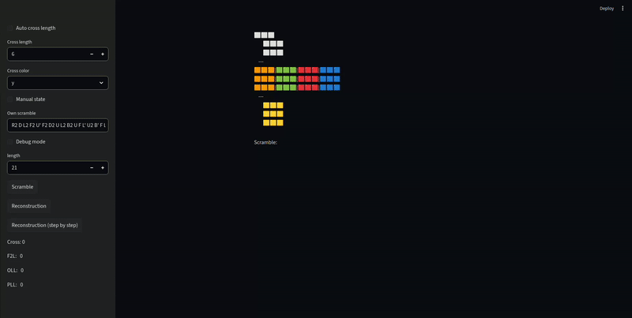

# Rubiks Cube Simulator

A 3x3 Rubik's Cube simulator using the CFOP method.  
The logic is implemented in Python and C (Python C-extension),  
and the user interface is built with Streamlit.

## 🎥 Demo



## ✨ Features

- Input your own scrambles or generate random ones
- Add custom algorithms
- Step-by-step reconstruction (manual and automatic)
- Automatic analysis of Cross, F2L, OLL, and PLL
- Debug mode: view cube state, binary conversion, and move logs

## 🛠 Tech Stack

- Python
- Streamlit (interactive frontend)
- C (Python C-extension for cube logic)

## ⚙️ Requirements

- Python 3.10+
- pip
- C compiler (gcc on Linux / MSVC on Windows)

The project has been tested on Linux.

If you are using Windows, first install **Visual Studio Build Tools**.

## 🚀 Installation

```bash
git clone https://github.com/twojlogin/projekt.git
cd projekt
pip install -r requirements.txt
pip install .
```

## ▶️ Running the Application

```bash
streamlit run app.py
```

## 🚀 Project Development

A more advanced [web version](https://github.com/elkamill0/rubiks-cube-symulator-js),
with a dynamic interface built in JavaScript and full client-side functionality.

## 🎯 Project Goal

The project aims to:

- Optimize cube operations using a C-extension
- Separate logic from the presentation layer
- Implement the CFOP method
- Provide an interactive tool for learning and analyzing Rubik's Cube moves
